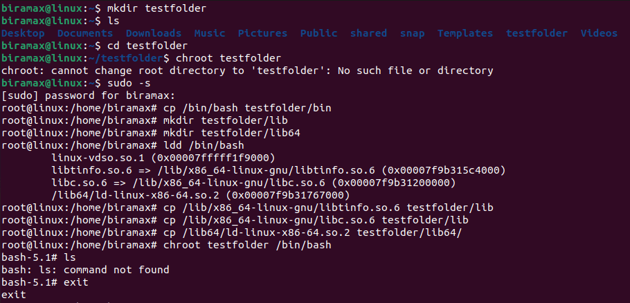
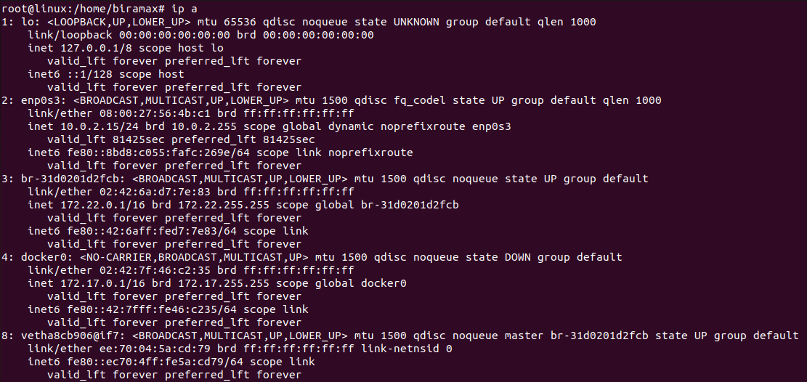
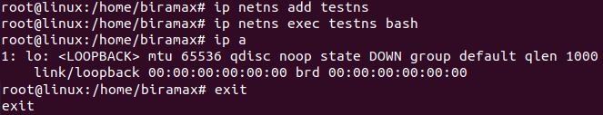
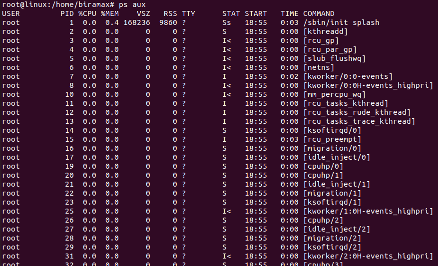
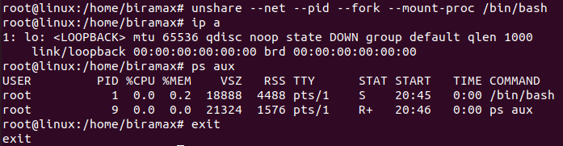

# Домашнее задание по семинару "Урок 1. Механизмы пространства имен"

## Задание: необходимо продемонстрировать изоляцию одного и того же приложения (как решено на семинаре - командного интерпретатора) в различных пространствах имен.

### 1. Вызов chroot

1) Создаём каталог `testfolder` в домашнем каталоге.
2) Входим под рутом.
3) Копируем исполняемый файл командного интерпретатора `/bin/bash` в папку `testfolder/bin`.
4) Через команду `ldd /bin/bash` выясняем какие бибилиотеки требуются для работы оболочки bash.
5) Создаем директории `testfolder/lib` и `testfolder/lib64` и копируем в них нужные библиотеки.
6) Запускаем команду `chroot` для изменения корневой папки. 
7) Убеждаемся, что в новой изолированной корневой папке невозможно выполнить простейшие команды, например, `ls`, т.к. для обеспечения выполнения разных команд нужно скопировать множество соответствующих исполняемых файлов. 
8) Выходим из изолированного файлового пространства командой `exit`.

### 2. Вызов ip netns

1) Вводим команду `ip a`, чтобы посмотреть доступные интерфейсы и сравнить их с теми, которые мы увидим после создания изолированного сетевого пространства.

2) Командой `ip netns add testns` создаём изолированное сетевое пространство, называем его `testns`. Запускаем в нём `bash` через команду `ip netns exec testns bash`. Проверяем доступные интерфейсы, повторяя команду `ip a`, и видим лишь единственный интерфейс.  
Выходим из сетевой изоляции командой `exit`.

### 3. Вызов unshare 

1) Вводим команду `ip a`, чтобы посмотреть доступные интерфейсы и сравнить их с теми, которые мы увидим после создания изолированного сетевого пространства.

2) Вводим также команду `ps aux`, чтобы увидеть процессы и сравнить потом с процессами в режиме изоляции.

3) Вводим команду `unshare --net --pid --fork --mount-proc /bin/bash`, где:  
`--net` — ограничевает сетевое пространство имен  
`--pid` — изолирует дерево процессов  
`--fork` — изолирует память  
`--mount-proc` — разграничивает процессы  
Формально мы попали в изолированный контейнер.  
Повторяем ввод команд `ip a` и `ps aux` и видим минимальный набор данных, т.к. смотрим их из контейнера, в котором ещё ничего не настроено и не запущено.  
Выходим из контейнера командой `exit`.

