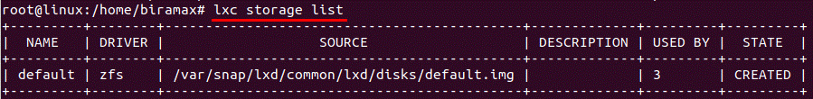
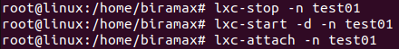

# Домашнее задание по семинару "Урок 2. Механизмы контрольных групп"

## 1. Запустить контейнер с ubuntu, используя механизм LXC

Устанавливаем пакеты для создания контейнеров LXC, включая утилиты debootstrap и bridge-utils, а также шаблоны контейнеров.

Устанавливаем инструмент LXD Installer для установки и настройки LXD на сервере.

Запускаем процесс настройки LXD.

Выводим список доступных хранилищ LXD на сервере.

Создаем новый контейнер с именем "test01" на базе образа Ubuntu.

Запускаем контейнер в режиме демона и подключаемся к нему.

## 2. Ограничить контейнер 256 Мб ОЗУ и проверить, что ограничение работает

Выясняем текущий размер оперативной памяти, выделенной для данного контейнера системой.

Чтобы изменить размер выделенной контейнеру памяти ОЗУ, выходим из контейнера и заходим в конфигурационный файл. Добавляем строку с ограничением памяти.

Перезагружаем контейнер.

Как показывается на лекции, команда `free -m` должна вывести новый объём памяти, но у меня она выводит прежнюю величину. Я поискал в интернете решение этой проблемы, в одной статье говорится следующее: 
> Команда free -m, выполненная в контейнере, будет все так же выводить информацию о памяти хоста. Откровенно, это очень плохо и не удобно, но такова текущая ситуация. Увидеть реально используемую контейнером память можно только на хосте - в файлах в cgroup-файловой системе.

Действительно, команда `cat /sys/fs/cgroup/lxc.payload.test01/memory.max` выводит корректную информацию.

268435456 байт как раз равняются 256 мегабайтам. 

