# Домашнее задание по семинару "Урок 3. Введение в Docker"

## 1. Установить Докер

Обновляем пакеты.

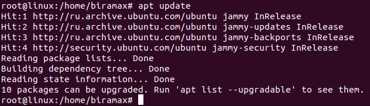

Устанавливаем пакеты, которые позволят использовать репозиторий по HTTPS.

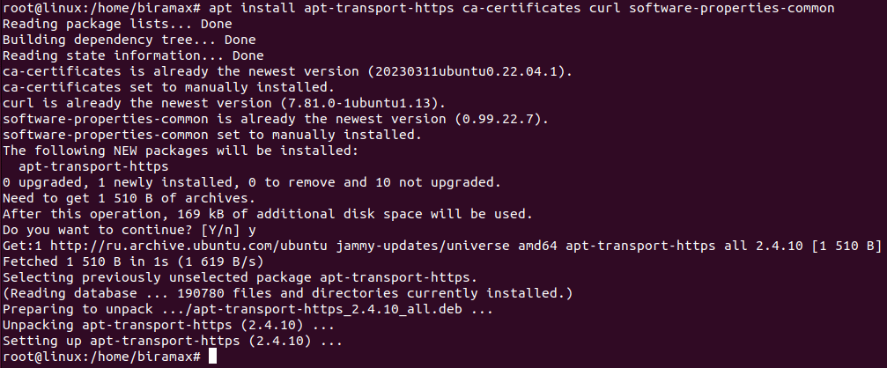

Добавляем официальный GPG-ключ Docker.

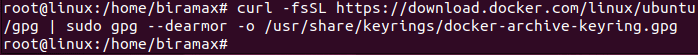

Добавляем репозиторий Docker к списку источников пакетов.

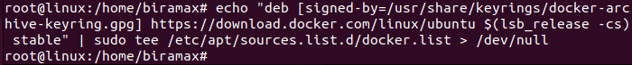

Обновляем список пакетов, чтобы включить информацию о пакетах Docker из добавленного репозитория.

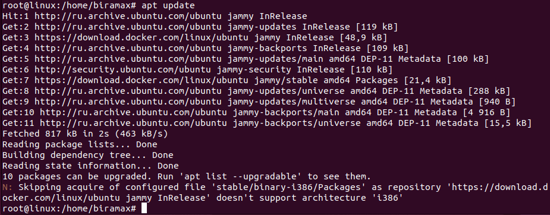

Устанавливаем Docker.

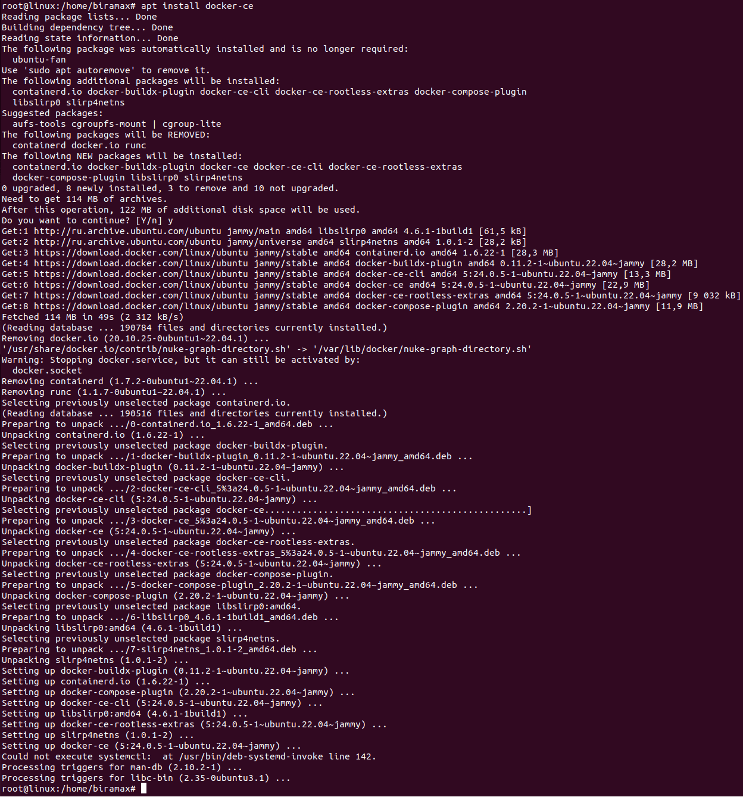

Добавляем своего пользователя в группу docker, чтобы избежать использования sudo для запуска Docker команд.
Применяем изменения (либо можно было перезагрузить систему).
Проверяем работу Докера.

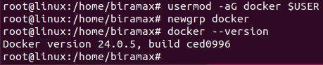

В итоге всё таки потребовалось перезагрузить систему, т.к. дальшейшие задания не хотели выполняться )

## 2. Протестировать установку Докера

Запускаем контейнер с использованием образа "cowsay".

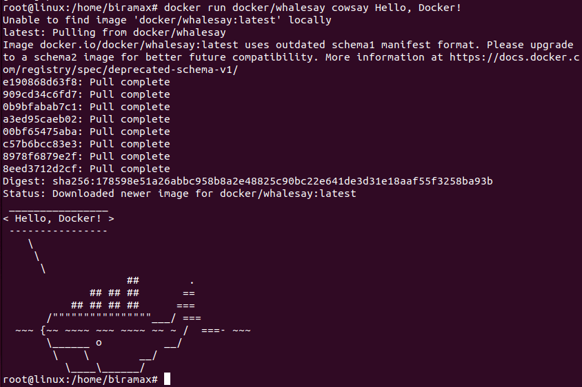

Пробуем запустить контейнер с рисунком слона )

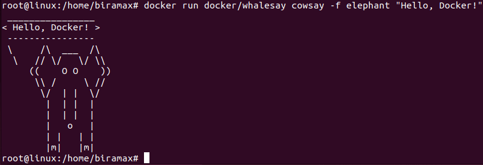

## 3. Протестировать разные команды Докера

Смотрим, какие образы у нас установлены.

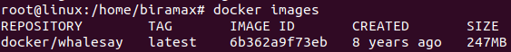

Смотрим список активных контейнеров (отсутствуют) и вообще всех имеющихся в системе (видим два контейнера, запущенных ранее).

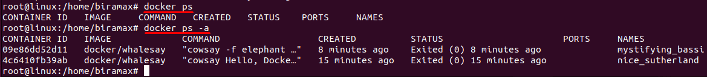

Удаляем один контейнер по его id. Проверяем список контейнеров после этого. И удаляем все оставшиеся контейнеры. Убеждаемся, что список контейнеров после этого пуст.

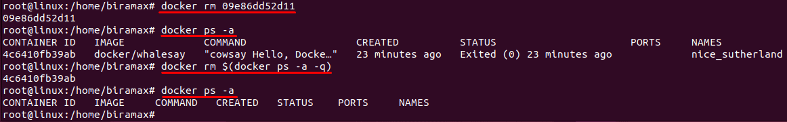

После этого можно удалить и сам образ. 

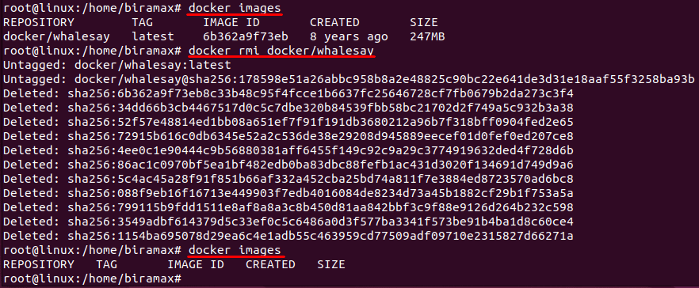

## 4. Протестировать хранение данных в контейнерах Docker

Запускаем контейнер из образа Ubuntu и входим в него.

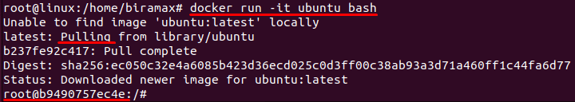

На скрине видно, что у нас нет установленного образа убунты, поэтому автоматически происходит скачивание последнего образа (т.к. мы не указали конкретную версию).  

Видим также, что мы вошли в терминал контейнера.

Выходим из контейнера и запускаем ту же команду, но с указанием имени хоста и имени контейнера, чтобы конейнер сразу получил их.

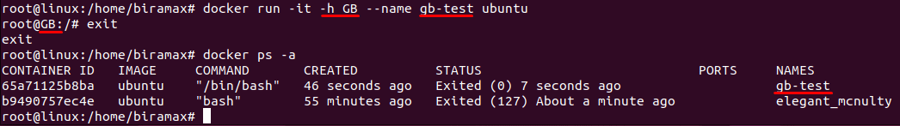

Поскольку мы вышли из контейнера, то мы его остановили. Запускаем его заново, используя его имя или id.

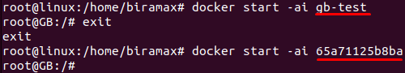

Посмотрим содержимое корневой директории.

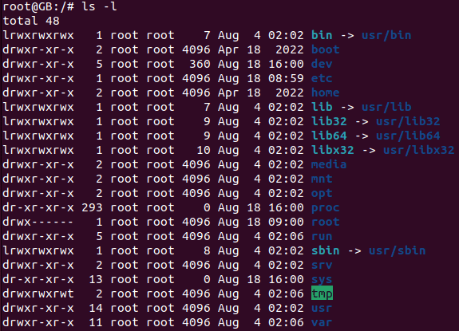

Создадим новую директорию в корне.

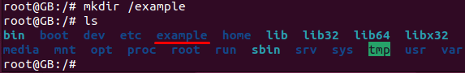

Создадим файл "passwords.txt", добавим в него какие-либо данные и сделаем вывод файла. В контейнере не установлен текстовый редактор, но мы справимся без него.

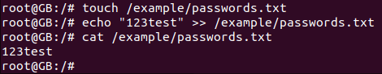

Проверим, сохранятся ли наши данные, если мы остановим контейнер и затем запустим его снова. Данные сохранились.

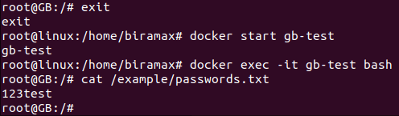

Теперь удалим контейнер и создадим его заново, используя те же команды. Увидим, что данные утеряны.

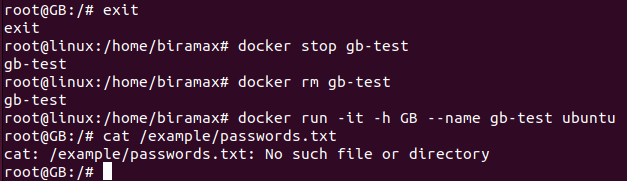

### Поработаем с внешним хранилищем

Создадим директорию `/test/folder` на хосте и подмонтируем ее к папке контейнера `/otherway`. Теперь всё, что сохраняется в папку контейнера `/otherway`, будет появляться также и в хостовой (за пределами контейнера, у родителя) папке `/test/folder`.
И если удалить контейнер, то данные в этой папке останутся.

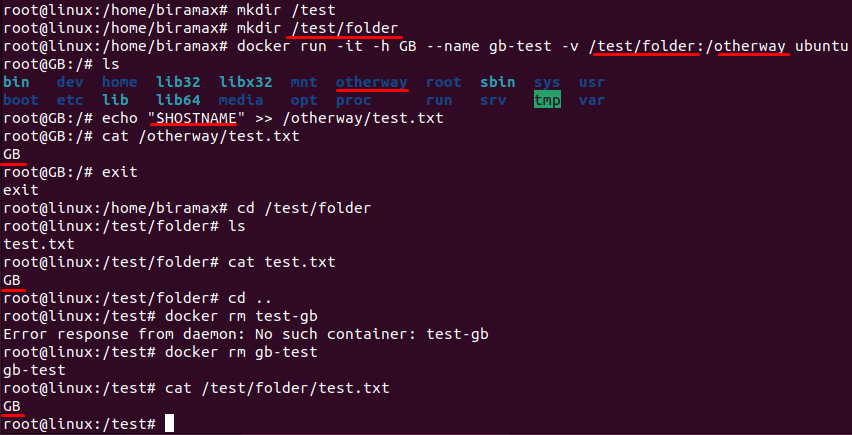

Это работает и в обратную сторону, даже если подключить контейнер к уже наполненной хостовой папке.

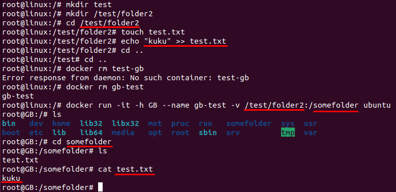

## Практическая ситуация хранения данных в Докере

Проработаем следующую ситуацию:

1. Создадим на хосте папку и в неё поместим файл `test.txt` c определённым содержимым.

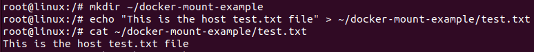

2. Затем в домашней папке хоста создадим файл с таким же названием `test.txt`, но с другим содержимым.

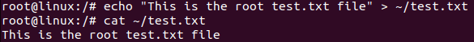

3. Затем создадим контейнер, в папку которого примонтируем хостовую папку и одновременно рутовый `test.txt`.

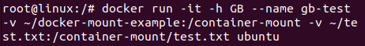

4. При просмотре содержимого файла `test.txt` в контейнере мы видим, что там будет содержимое рутового файла `test.txt`, а не файла `test.txt` из примонтированной папки.

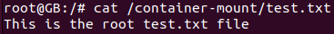

Так что нужно иметь ввиду эту особенность, когда мы монтируем что-то сверху того, что уже примонтировано )