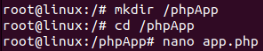
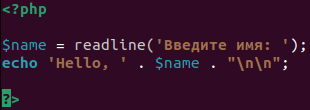
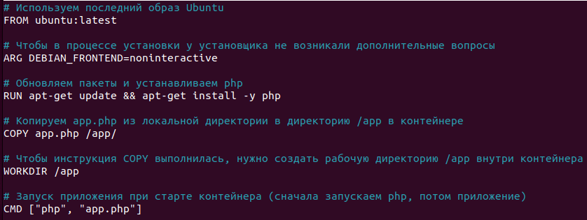
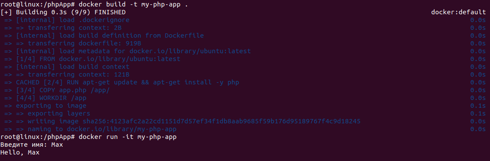

# Домашнее задание по семинару "Урок 4. Dockerfile и слои"

## Необходимо создать Dockerfile, основанный на любом образе (вы в праве выбрать самостоятельно). В него необходимо поместить приложение, написанное на любом известном вам языке программирования (Python, Java, C, С#, C++). При запуске контейнера должно запускаться самостоятельно написанное приложение.

Поскольку я хорошо знаком с языком PHP, создал на этом языке похожее приложение, как мы делали на семинаре :)

1. Создаём папку `phpApp` и в ней создаём файл `app.php` с php-скриптом.

2. В той же папке создаём Dockerfile.

В процессе установки косоль просила указать временную зону. Чтобы установщик не задавал вопросов, в интернете советуют в докерфайл добавить строку:  

`ARG DEBIAN_FRONTEND=noninteractive`  

Что я и сделал. Проблема ушла.

3. Затем ввёл команду на сборку докерфайла и на запуск контейнера. Программа отработала!
На скрине видно, что докер очень быстро собрался. Это потому что это уже далеко не первый раз его сборки, т.к. он по разным причинам не хотел собираться, и не с первого раза заработал скрипт. Но в итоге всё получилось ) 

