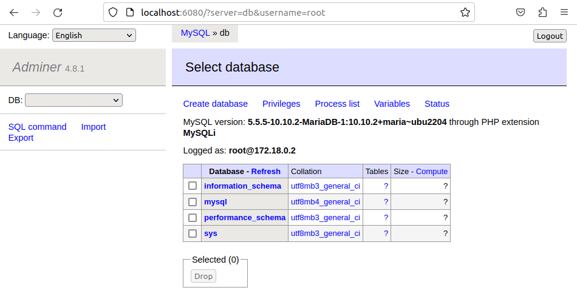

# Домашнее задание по семинару "Урок 5. Docker Compose и Docker Swarm"

## Создать сервис, состоящий из 2 различных контейнеров: 1 - веб, 2 - БД (compose)

1. Создаём папку под проект. Переходим в неё.

2. Создаём в папке yaml-файл с именем по умолчанию docker-compose.yml.

3. Устанавливаем docker-compose (у меня он уже был установлен ранее).  

4. Создаём и запускаем проект, в фоновом режиме, без указания имени yaml-файла, т.к. он имеет имя по умолчанию.

5. Смотрим, что у нас появилось два контейнера.

6. Мы пробрасывали порты - из порта контейнера 8080 на порт хоста 6080, поэтому чтобы открыть веб-приложение (в данном случае Adminer), открываем страницу под адресом http://localhost:6080 

7. Вбиваем в форму имя пользоваля root и пароль, который мы указывали в докер-компоуз файле в переменных среды - test123, и входим в Adminer. Видим, что используется база данных MariaDB.

